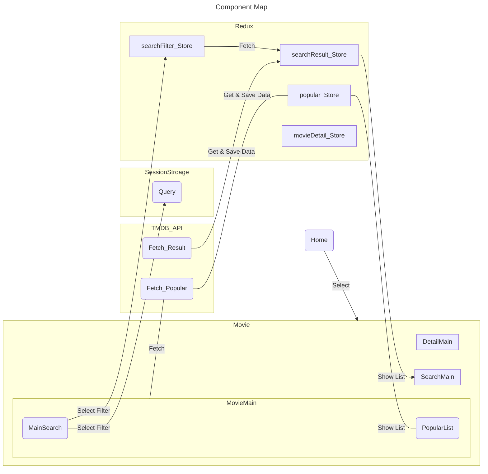

# Next_Template

```mermaid
---
title : Component Map
---
flowchart LR
    home(Home)
    subgraph Movie
        direction LR
        subgraph MovieMain
            mainsearch(MainSearch)
            popularlist(PopularList)
        end
        subgraph SearchMain
            
        end
        subgraph DetailMain

        end
    end
    subgraph TMDB_API
        direction TB
        f_popular(Fetch_Popular)
        f_search(Fetch_Result)
    end
    subgraph SessionStroage
        query(Query)
    end
    subgraph Redux
        direction TB
        popular[popular_Store]
        search[searchFilter_Store]
        result[searchResult_Store]
        detail[movieDetail_Store]
    end
    

home -->|Select|Movie
MovieMain ---|Fetch|f_popular ---|Get & Save Data|popular ---|Show List|popularlist
mainsearch -->|Select Filter|search -->|Fetch|result
mainsearch -->|Select Filter|query
f_search -->|Get & Save Data|result -->|Show List|SearchMain


```
