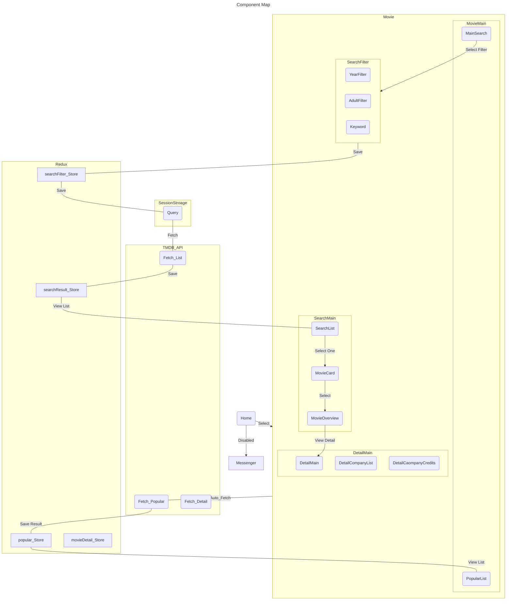

# Next_Template
This is a personal project based on Reactjs and Nextjs. 
Project internal services will be added on an ongoing basis. 
Please refer to the link below for development records and details
### Link
Deploy : [Vercel](https://next-template-alpha-ten.vercel.app)  
Blog : [Notion](https://nervous-piper-af7.notion.site/39217964f90746028a396f2829fed6a2?v=ee8667e0578548e4b05ed1fbe4af0bd8&p=631cae7ca1084844b5405a4bc3230baf&pm=c)
### Version
- 0.1.0 - Develop and Deploy 'MoviePage'
> You can use the TMDB API to search and view movie information.
>> Search - Search by title through filtering according to release year and adult content  
>> Popular - Based on the TMDB API, you can display a list of the current popular movies and view simple information  
>> Detail _ You can view the details of the selected movies in the search and popular movie list.  
>> - Display the filmmaker or actor and select them to view the details  
>> - View videos and images related to the selected movie  
>> - If there is Collection information, display the list and go to the movie's details when selected.
## Component Map

    
View Map(In Making...)

