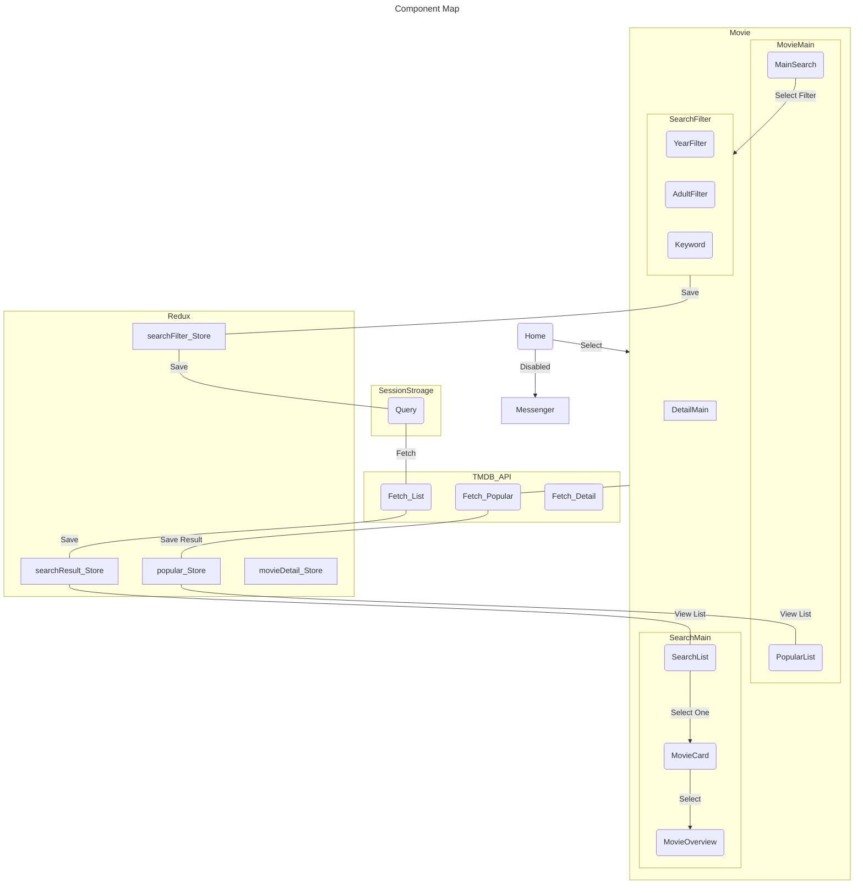

# Next_Template

```mermaid
---
title : Component Map
---
flowchart TB
    home(Home)
    subgraph Movie
        direction TB
        subgraph MovieMain
            direction LR
            mainsearch(MainSearch)
            popularlist(PopularList)
        end
        subgraph SearchFilter
            sf_year(YearFilter)
            sf_adult(AdultFilter)
            sf_keyword(Keyword)
        end
        subgraph SearchMain
            sm_list(SearchList) --->|Select One|sm_card(MovieCard) --->|Select|sm_overview(MovieOverview)
        end
        subgraph DetailMain

        end
    end
    subgraph TMDB_API
        direction TB
        f_popular(Fetch_Popular)
        f_search(Fetch_List)
        f_detail(Fetch_Detail)
    end
    subgraph SessionStroage
        s_query(Query)
    end
    subgraph Redux
        direction LR
        r_popular[popular_Store]
        r_search[searchFilter_Store]
        r_result[searchResult_Store]
        r_detail[movieDetail_Store]
    end
home -->|Select|Movie
home -->|Disabled|Messenger
Movie ---|Auto_Fetch|f_popular ---|Save Result|r_popular ---|View List|popularlist
mainsearch -->|Select Filter|SearchFilter --- |Save|r_search ---|Save|s_query
s_query ---|Fetch|f_search ---|Save|r_result ---|View List|sm_list
```
